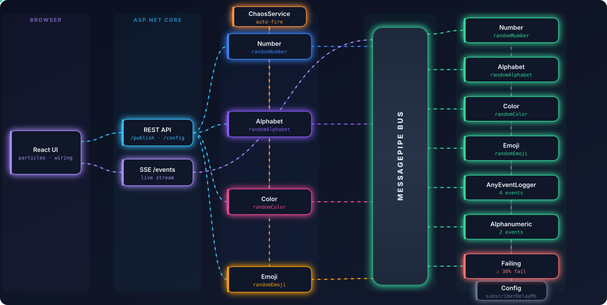

# Pub/Sub Visualiser

A real-time, animated visualisation of an in-process **publish/subscribe** system. A
.NET backend runs publishers and subscribers over the [MessagePipe](https://github.com/Cysharp/MessagePipe)
bus and streams every event to a React frontend over **Server-Sent Events**, where
messages fly between actors as animated particles.

<p align="center">
  
</p>

> The diagram above is a self-animating SVG — flowing connections and travelling
> data packets show the live path of an event through the system. It's generated
> from the real actor wiring by [`scripts/generate-arch-svg.mjs`](scripts/generate-arch-svg.mjs),
> and the app renders an interactive version of it under the **⬡ Architecture** toggle.

## How it works

```
React UI ──▶ REST API ──▶ Publishers ──▶ ┌─────────────┐ ──▶ Subscribers
   ▲                                      │ MessagePipe │
   └────────── SSE /events ◀───────────── │     Bus     │ ◀── (consumed events)
                                          └─────────────┘
            ChaosService ─▶ Publishers          Config ─▶ Subscribers (delay)
```

1. A **Publisher** fires a typed event (`randomNumber`, `randomAlphabet`, `randomColor`, `randomEmoji`) onto the MessagePipe bus.
2. **Subscribers** listening to that event handle it (after a configurable delay) and re-publish a `consumed` event.
3. A single **SSE endpoint** (`/events`) subscribes to every topic and streams each occurrence to the browser.
4. The **frontend** turns each streamed event into a particle animation, pulses the wiring between cards, and updates live stats.

## Features

- ⚡ **Live particle flow** — every event animates from publisher to each listening subscriber.
- 🔌 **SSE streaming** — backend pushes events to the UI in real time; no polling.
- 🧩 **Fan-out & multi-subscribe** — e.g. `AnyEventLogger` listens to all 4 events, `AlphanumericSubscriber` to 2.
- 💥 **Chaos mode** — `ChaosService` auto-fires random publishers at a configurable interval.
- ⚠️ **Failure simulation** — `FailingSubscriber` fails ~30% of the time with up to 3 retries, rendered with retry/failed badges.
- ☠ **Dead-letter queue** — exhausted messages are dead-lettered to a `DeadLetterQueue` actor; inspect, **replay**, and clear them from the UI panel.
- 🎚️ **Live config** — adjust subscriber processing delay from the UI and watch the animation speed respond.
- 🔀 **Pluggable transport** — same visualiser over the in-process bus or a real Kafka broker via the `IMessageBus` seam.
- 📊 **Observability** — OpenTelemetry metrics at `/metrics` (Prometheus) and OTLP traces, with Grafana/Jaeger overlays.
- ⬡ **Animated architecture diagram** — a fully animated SVG view of the running system, baked into the app.

## Tech stack

| Layer | Stack |
|-------|-------|
| Backend | .NET 8 Minimal API, [MessagePipe](https://github.com/Cysharp/MessagePipe) in-process pub/sub, SSE via `System.Threading.Channels` |
| Frontend | React 19 + TypeScript, Vite, animated SVG (CSS keyframes + SMIL) |

## Project structure

```
pubsub-visualiser/
├── backend/                       # ASP.NET Core Minimal API
│   ├── Program.cs                 # endpoints, actor wiring, SSE stream
│   └── Services/                  # Publisher, Subscriber, FailingSubscriber, ChaosService, Config
├── frontend/                      # React + Vite app
│   └── src/
│       ├── App.tsx                # state orchestration + SSE client
│       └── components/            # ParticleLayer, WiringLayer, StatsBar, ArchitectureDiagram
├── docs/architecture.svg          # generated animated diagram (used in this README)
└── scripts/generate-arch-svg.mjs  # regenerates docs/architecture.svg
```

## Getting started

**Prerequisites:** [.NET 8 SDK](https://dotnet.microsoft.com/download) and [Node.js 18+](https://nodejs.org).

### 1. Backend (port 5080)

```bash
cd backend
dotnet run
```

### 2. Frontend (port 5173)

```bash
cd frontend
npm install
npm run dev
```

Open <http://localhost:5173>. Click **⚡ Publish all**, flip on **Chaos**, and toggle **⬡ Architecture**.

### Run with Docker

```bash
docker compose up --build
```

Then open <http://localhost:8080> (the API is published on `localhost:5080`). The
backend and frontend each build from their own multi-stage `Dockerfile`; the frontend
is served by nginx with the API URL baked in via the `VITE_API_URL` build arg.

### Run against a real Kafka broker

```bash
docker compose -f docker-compose.yml -f docker-compose.kafka.yml up --build
```

This adds a single-node Kafka broker (KRaft mode — no ZooKeeper) and switches the
backend to `Bus:Provider=kafka`. The same particle animation is now driven by a real
broker. A [Kafka UI](http://localhost:8085) is included to inspect topics, partitions
and messages.

### Observability (metrics + traces)

```bash
docker compose -f docker-compose.yml -f docker-compose.observability.yml up --build
```

Adds Prometheus, Grafana, and Jaeger. Overlays compose, so combine with the Kafka
overlay too (`-f docker-compose.kafka.yml`) to observe a real broker.

| Tool | URL | What |
|------|-----|------|
| Grafana | <http://localhost:3000> (`admin`/`admin`) | Pre-provisioned **Pub/Sub Visualiser** dashboard |
| Prometheus | <http://localhost:9090> | Scrapes the backend's `/metrics` |
| Jaeger | <http://localhost:16686> | Publish→consume trace spans |

The backend always exposes Prometheus metrics at **`/metrics`** (custom
`pubsub_messages_published/consumed/failed/retries_total`, a processing-duration
histogram, and an `pubsub_sse_clients` gauge — all tagged by actor) plus ASP.NET Core
and .NET runtime metrics. Traces are emitted on the `PubSubVisualiser` activity source
and exported via OTLP when `Otlp:Endpoint` is set (the overlay points it at Jaeger).

## Message transport

The backend talks to its bus through a single `IMessageBus` seam
([`Services/Messaging`](backend/Services/Messaging/)), selected at startup via the
`Bus:Provider` config key:

| Provider | Status | Notes |
|----------|--------|-------|
| `inprocess` *(default)* | ✅ | MessagePipe in-process bus — no network, no durability |
| `kafka` | ✅ | Real broker adapter ([Confluent.Kafka](https://github.com/confluentinc/confluent-kafka-dotnet)); event names → topics, JSON payloads |

Publishers, subscribers, and the SSE endpoint all depend only on `IMessageBus`, so
swapping the transport doesn't touch the visualiser. The Kafka adapter gives each
subscription its own consumer group, so every subscriber receives every message
(broadcast fan-out matching the in-process bus). Configure with `Kafka:BootstrapServers`
and `Kafka:TopicPrefix`.

## Branches

| Branch | What it is |
|--------|-----------|
| `version/on-prem` | The original in-process-only version (no Docker, no transport seam) |
| `version/docker` | Containerised version with the `IMessageBus` abstraction; target for the real-broker + observability roadmap |

## API

| Method | Route | Description |
|--------|-------|-------------|
| `GET`  | `/actors` | All publishers and subscribers with their event names |
| `POST` | `/publishers/{name}/publish` | Fire a single publisher |
| `POST` | `/publish-all` | Fire every publisher once |
| `GET`  | `/events` | **SSE** stream of every event on the bus |
| `GET` / `PUT` | `/config` | Read / set the subscriber processing delay (ms) |
| `GET`  | `/chaos` | Chaos mode status |
| `POST` | `/chaos/start` · `/chaos/stop` | Start / stop auto-firing |
| `GET`  | `/dead-letters` | List dead-lettered messages (with count) |
| `POST` | `/dead-letters/{id}/replay` | Replay one dead letter (re-publishes the original event) |
| `DELETE` | `/dead-letters` | Clear the dead-letter queue |
| `GET`  | `/metrics` | Prometheus metrics (custom + ASP.NET Core + runtime) |

## Regenerating the diagram

The architecture SVG is generated from the actual actor wiring:

```bash
node scripts/generate-arch-svg.mjs
```

---

🤖 Architecture diagram and scaffolding generated with [Claude Code](https://claude.com/claude-code)
